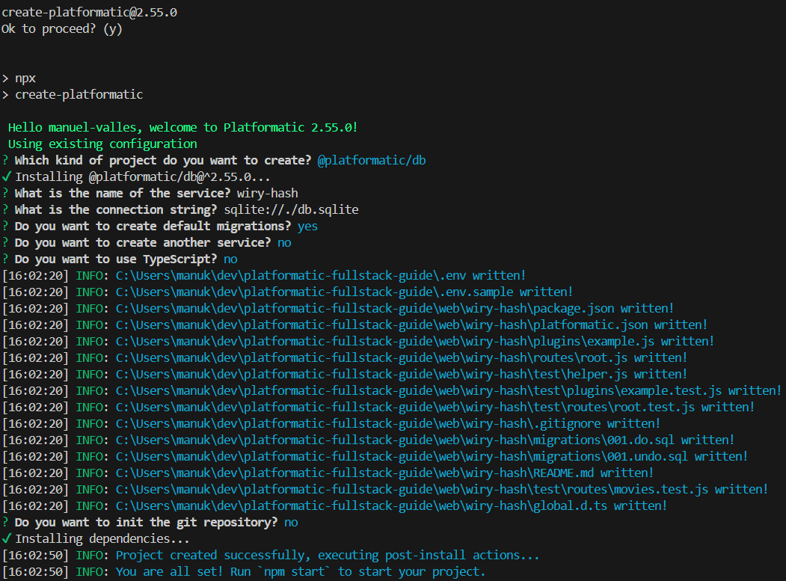
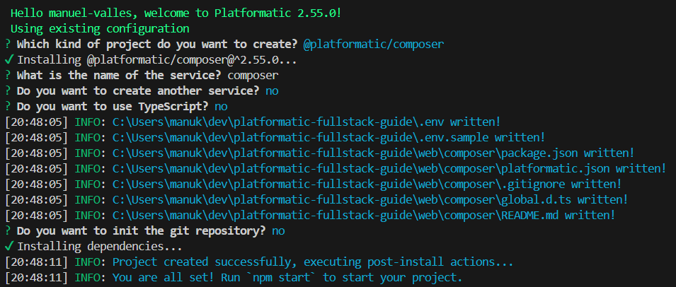

# Fullstack Guide with Platformatic Services

This guide will help you setup and run your first full-stack Platformatic app (a movie quotes app to add, like and delete quotes from popular movies).

## 1. Install Platformatic Watt

- `npx wattpm@latest init`
- `npm i`

## 2. Add Platformatic DB

- `npm create platformatic@latest`
  
- `npm run dev`. This will automatically serve REST and GraphQL interfaces for your SQL database

## 3. Update DB

- Add a  to include the `quotes` table, and
  the property `likes`
- Apply schema migrations (from the path `./web/movies-api/migrations`): `npx platformatic db migrations apply`

## 4. Add Composer Service

[Platformatic Composer](https://platformatic.dev/docs/next/composer/overview) is designed to automatically integrate microservices into one ecosystem, providing a single public API for more efficient management and deployment.

- `npx create-platformatic`
- 

## 5. Add a React App

- `cd web`
- `npm create vite@latest frontend -- --template react`
- `cd frontend`
- `npm i`
- `npm run dev`
